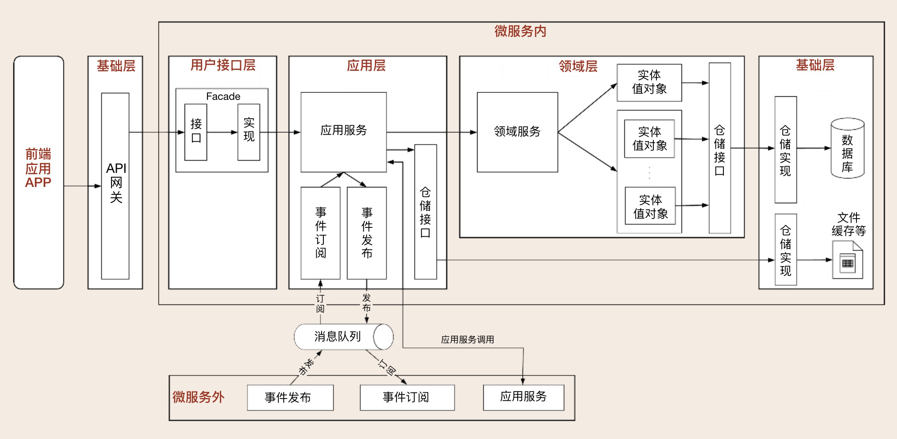
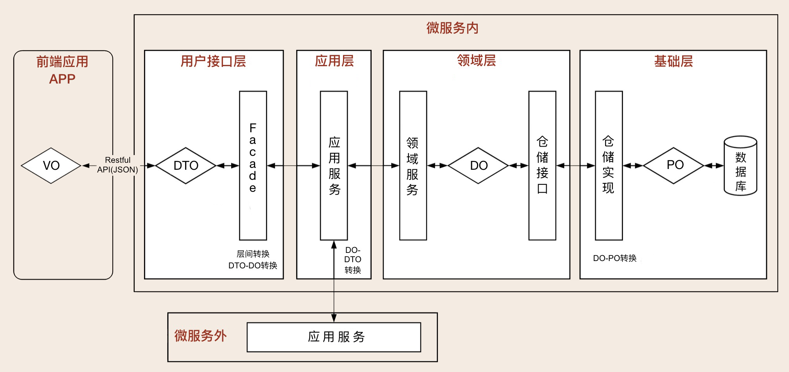
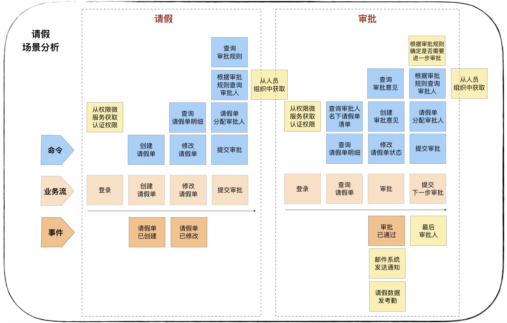
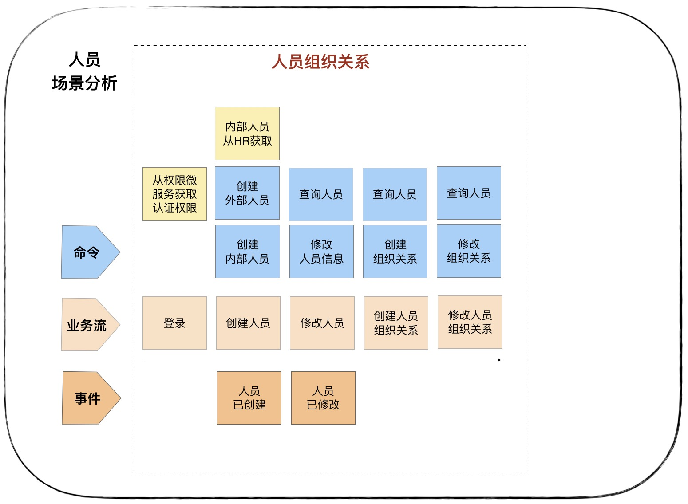
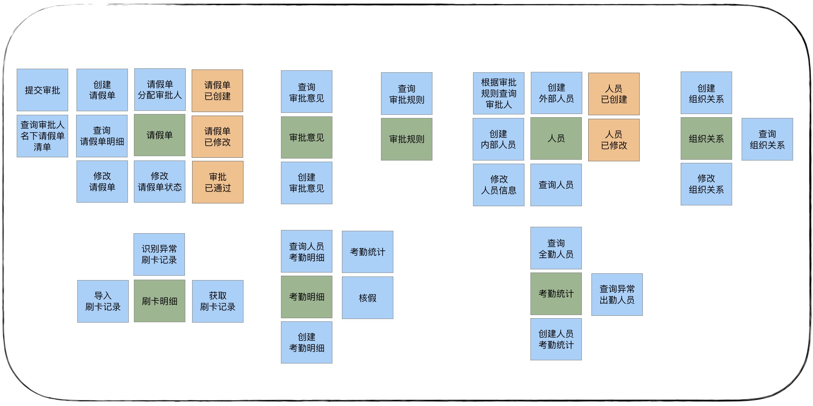
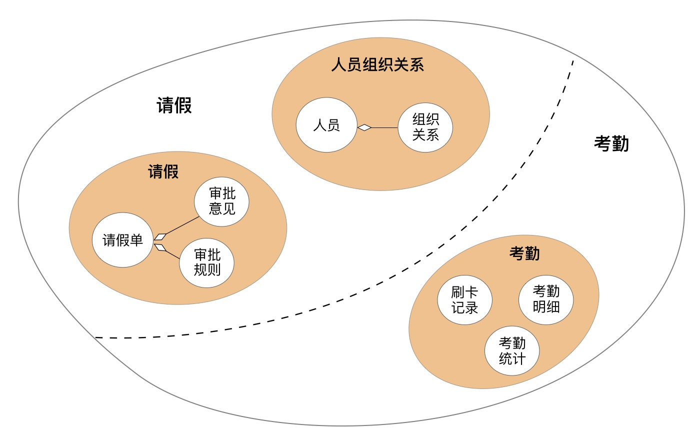
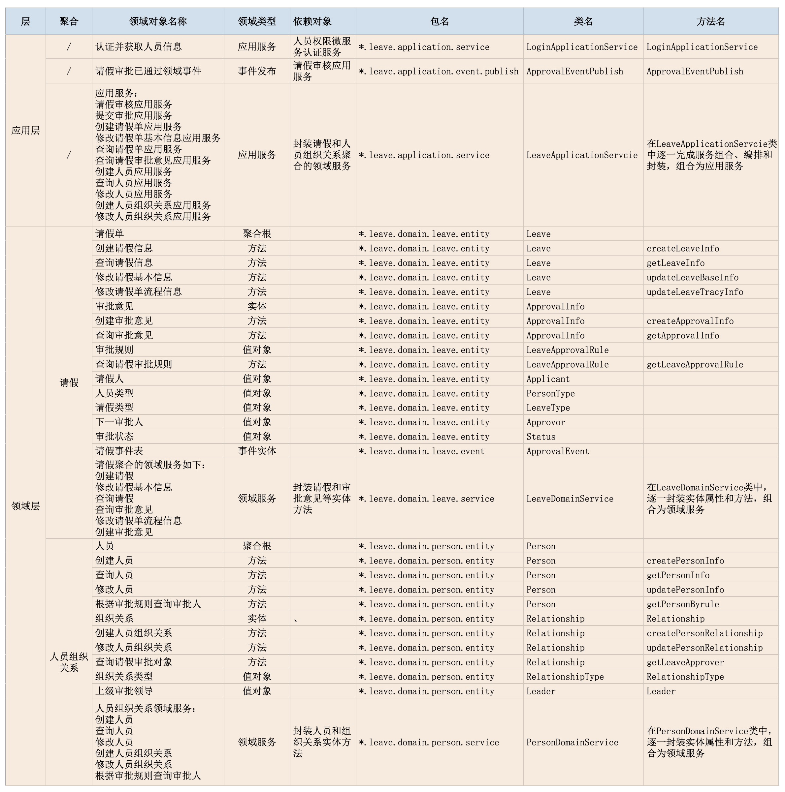

## 1、目录结构

- 整体架构图

- 数据对象
  - 数据持久化对象 PO(Persistent Object)，与数据库结构一一映射，是数据持久化过程中的数据载体。
  - 领域对象 DO（Domain Object），微服务运行时的实体，是核心业务的载体。
  - 数据传输对象 DTO（Data Transfer Object），用于前端与应用层或者微服务之间的数据组装和传输，是应用之间数据传输的载体。
  - 视图对象 VO（View Object），用于封装展示层指定页面或组件的数据。

### 用户接口层 interfaces

- assembler: 实现dto与领域对象之间的相互转换和数据交换。一般来说 Assembler 与 DTO 总是一同出现。
- dto: 它是数据传输的载体，内部不存在任何业务逻辑，我们可以通过 DTO 把内部的领域对象与外界隔离。
- facade: 提供较粗粒度的调用接口，将用户请求委派给一个或多个应用服务进行处理。

### 应用层 application
- event: 事件相关代码，最好放在应用层
  - publish: 发布事件
  - subscribe: 订阅事件
- service：应用服务，对多个领域服务或外部应用服务进行封装、编排和组合，对外提供粗粒度的服务

### 领域层 domain

- aggregate00: 聚合，聚合软件包的根目录，可以根据实际项目的聚合名称命名，比如权限聚合
  - entity: 存放聚合根、实体、值对象以及工厂模式（Factory）相关代码
  - event: 事件相关实体
  - service: 领域服务，一个领域服务是多个实体组合出来的一段业务逻辑。你可以将聚合内所有领域服务都放在一个领域服务类中，你也可以把每一个领域服务设计为一个类。
  - repository: 仓储，存放所在聚合的查询或持久化领域对象的代码，通常包括仓储接口和仓储实现方法。为了方便聚合的拆分和组合，我们设定了一个原则：一个聚合对应一个仓储。

### 基础层 infrastructure

- config : 配置相关
- util: 通用代码
  - api
  - driver
  - eventbus
  - mq

## 设计思路

### 1、项目基本信息
- 实现在线请假和考勤管理，功能如下：
- 请假人填写请假单提交审批，根据请假人身份、请假类型和请假天数进行校验，根据审批规则逐级递交上级审批，逐级核批通过则完成审批，否则审批不通过退回申请人。根据考勤规则，核销请假数据后，对考勤数据进行校验，输出考勤统计。

### 2、场景分析
- 请假

- 人员

### 3、建模
- 找出实体和值对象， 

- 定义聚合

聚合根是请假单和人员

- 定义限界上下文

由于人员组织关系聚合与请假聚合，共同完成请假的业务功能，两者在请假的限界上下文内。考勤聚合则单独构成考勤统计限界上下文。

### 4、对象清单

## 领域对象设计